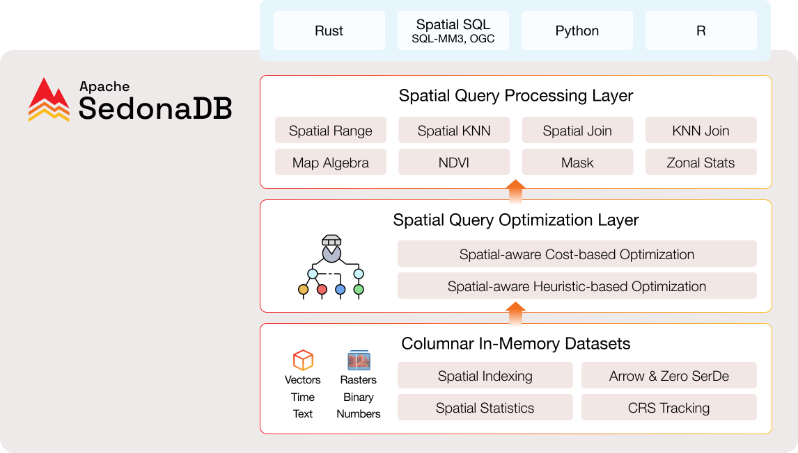

---

title: Introducing SedonaDB
---

<!---
  Licensed to the Apache Software Foundation (ASF) under one
  or more contributor license agreements.  See the NOTICE file
  distributed with this work for additional information
  regarding copyright ownership.  The ASF licenses this file
  to you under the Apache License, Version 2.0 (the
  "License"); you may not use this file except in compliance
  with the License.  You may obtain a copy of the License at

    http://www.apache.org/licenses/LICENSE-2.0

  Unless required by applicable law or agreed to in writing,
  software distributed under the License is distributed on an
  "AS IS" BASIS, WITHOUT WARRANTIES OR CONDITIONS OF ANY
  KIND, either express or implied.  See the License for the
  specific language governing permissions and limitations
  under the License.
-->

SedonaDB is an open-source single-node analytical database engine with **geospatial as a first-class citizen**. It aims to deliver the fastest spatial analytics query speed and the most comprehensive function coverage available.

SedonaDB is perfect for processing smaller to medium datasets on local machines or cloud instances. For distributed workloads, you can leverage the power of SedonaSpark, SedonaFlink, or SedonaSnow.

## Architecture



* **Columnar in-memory datasets**
    * Spatial indexing
    * Spatial statistics
    * CRS tracking
    * Arrow format and zero serialization overhead

* **Spatial query optimization**
    * Spatial-aware heuristic based optimization
    * Spatial-aware cost based optimization

* **Spatial query processing**
    * Spatial range query, KNN query, spatial join query, KNN join query
    * Map algebra, NDVI, mask, zonal statistics

Raster functions are coming soon. We expect SedonaDB Raster will match all raster functions provided in [SedonaSpark](https://sedona.apache.org/latest/api/sql/Raster-operators/).

## Key features

SedonaDB has several advantages:

* **🚀 High Performance:** Built in Rust for exceptional speed and memory efficiency
* **🗺️ Comprehensive Spatial Toolkit:** Supports both vector and raster functions in a single library
* **🌍 CRS Propagation:** Always maintains coordinate reference system information
* **📁 Format Flexibility:** Supports legacy and modern file formats including GeoParquet, Shapefile, GeoJSON
* **⚡ Dual APIs:** Python and SQL interfaces for seamless workflow integration
* **🔧 Extensible:** Easily customizable and extensible architecture
* **🔗 Ecosystem Integration:** Interoperable with PyArrow-compatible libraries like GeoPandas, DuckDB, and Polars

## Install SedonaDB

Here's how to install SedonaDB with various build tools:

=== "pip"

	```bash
	pip install "apache-sedona[db]"
	```

=== "R"

	```bash
	install.packages("sedonadb", repos = "https://community.r-multiverse.org")
	```

## Run a query

SedonaDB offers a flexible query interface.

=== "Python"

	```python
	import sedona.db

	sd = sedona.db.connect()
	sd.sql("SELECT ST_Point(0, 1) as geom")
	```

=== "R"

  ```r
  library(sedonadb)

  sd_sql("SELECT ST_Point(0, 1) as geom")
  ```

## Have questions?

Start a [GitHub Discussion](https://github.com/apache/sedona/discussions) or join the [Discord community](https://discord.com/invite/9A3k5dEBsY) and ask the developers any questions you may have.

We look forward to collaborating with you!
