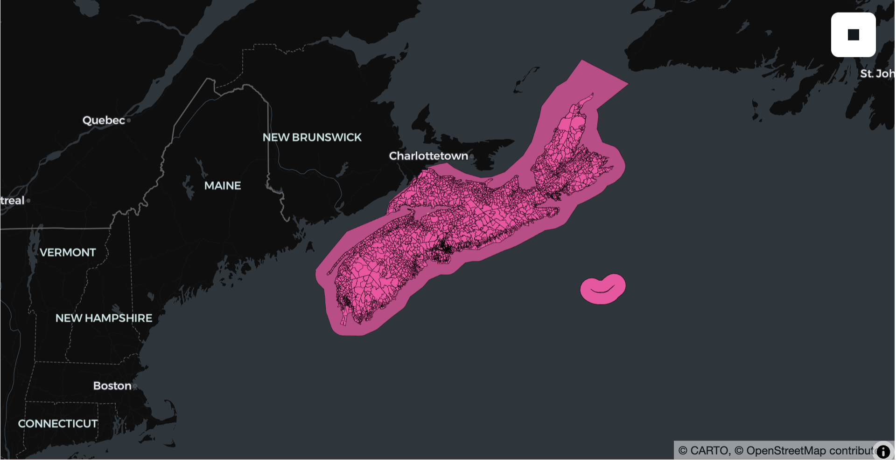

<!---
  Licensed to the Apache Software Foundation (ASF) under one
  or more contributor license agreements.  See the NOTICE file
  distributed with this work for additional information
  regarding copyright ownership.  The ASF licenses this file
  to you under the Apache License, Version 2.0 (the
  "License"); you may not use this file except in compliance
  with the License.  You may obtain a copy of the License at

    http://www.apache.org/licenses/LICENSE-2.0

  Unless required by applicable law or agreed to in writing,
  software distributed under the License is distributed on an
  "AS IS" BASIS, WITHOUT WARRANTIES OR CONDITIONS OF ANY
  KIND, either express or implied.  See the License for the
  specific language governing permissions and limitations
  under the License.
-->

# SedonaDB Overture Examples

> Note: Before running this notebook, ensure that you have installed SedonaDB: `pip install "apache-sedona[db]"`

This notebook demonstrates how to query and analyze the [Overture Maps](https://overturemaps.org/) dataset using SedonaDB.

The notebook explains how to:

* Load Overture data for the `buildings` and `divisions` themes directly from S3.
* Perform spatial queries to find features within a specific geographic area.
* Optimize subsequent query performance by caching a subset of data in memory.


```python
%pip install lonboard
```


```python
import sedona.db
import os

os.environ["AWS_SKIP_SIGNATURE"] = "true"
os.environ["AWS_DEFAULT_REGION"] = "us-west-2"

sd = sedona.db.connect()
```

## Overture buildings table


```python
df = sd.read_parquet(
    "s3://overturemaps-us-west-2/release/2025-08-20.0/theme=buildings/type=building/"
)
```


```python
df.limit(10).show()
```

    ┌──────────────────────────────────────┬─────────────────────────────────────────┬───┬─────────────┐
    │                  id                  ┆                 geometry                ┆ … ┆ roof_height │
    │                 utf8                 ┆                 geometry                ┆   ┆   float64   │
    ╞══════════════════════════════════════╪═════════════════════════════════════════╪═══╪═════════════╡
    │ afc55d29-5916-42ad-8f9c-76ba9d749be9 ┆ POLYGON((-74.5920939 4.893956,-74.5920… ┆ … ┆             │
    ├╌╌╌╌╌╌╌╌╌╌╌╌╌╌╌╌╌╌╌╌╌╌╌╌╌╌╌╌╌╌╌╌╌╌╌╌╌╌┼╌╌╌╌╌╌╌╌╌╌╌╌╌╌╌╌╌╌╌╌╌╌╌╌╌╌╌╌╌╌╌╌╌╌╌╌╌╌╌╌╌┼╌╌╌┼╌╌╌╌╌╌╌╌╌╌╌╌╌┤
    │ 9c7ece54-88ff-48d4-8b48-11959fb058a1 ┆ POLYGON((-74.5906253 4.8896057,-74.590… ┆ … ┆             │
    ├╌╌╌╌╌╌╌╌╌╌╌╌╌╌╌╌╌╌╌╌╌╌╌╌╌╌╌╌╌╌╌╌╌╌╌╌╌╌┼╌╌╌╌╌╌╌╌╌╌╌╌╌╌╌╌╌╌╌╌╌╌╌╌╌╌╌╌╌╌╌╌╌╌╌╌╌╌╌╌╌┼╌╌╌┼╌╌╌╌╌╌╌╌╌╌╌╌╌┤
    │ 24fde8c7-6771-4205-b9da-2599d825f85f ┆ POLYGON((-74.5905666 4.8896679,-74.590… ┆ … ┆             │
    ├╌╌╌╌╌╌╌╌╌╌╌╌╌╌╌╌╌╌╌╌╌╌╌╌╌╌╌╌╌╌╌╌╌╌╌╌╌╌┼╌╌╌╌╌╌╌╌╌╌╌╌╌╌╌╌╌╌╌╌╌╌╌╌╌╌╌╌╌╌╌╌╌╌╌╌╌╌╌╌╌┼╌╌╌┼╌╌╌╌╌╌╌╌╌╌╌╌╌┤
    │ 79bdbb6f-5a9f-4b35-8e30-eb9019a6a1d7 ┆ POLYGON((-74.5905272 4.8896867,-74.590… ┆ … ┆             │
    ├╌╌╌╌╌╌╌╌╌╌╌╌╌╌╌╌╌╌╌╌╌╌╌╌╌╌╌╌╌╌╌╌╌╌╌╌╌╌┼╌╌╌╌╌╌╌╌╌╌╌╌╌╌╌╌╌╌╌╌╌╌╌╌╌╌╌╌╌╌╌╌╌╌╌╌╌╌╌╌╌┼╌╌╌┼╌╌╌╌╌╌╌╌╌╌╌╌╌┤
    │ 45ca1264-1062-41de-9375-82d93d93ee31 ┆ POLYGON((-74.590441 4.8897205,-74.5904… ┆ … ┆             │
    ├╌╌╌╌╌╌╌╌╌╌╌╌╌╌╌╌╌╌╌╌╌╌╌╌╌╌╌╌╌╌╌╌╌╌╌╌╌╌┼╌╌╌╌╌╌╌╌╌╌╌╌╌╌╌╌╌╌╌╌╌╌╌╌╌╌╌╌╌╌╌╌╌╌╌╌╌╌╌╌╌┼╌╌╌┼╌╌╌╌╌╌╌╌╌╌╌╌╌┤
    │ b22e0827-bc09-439f-85cf-5401db561a23 ┆ POLYGON((-74.5903646 4.889949,-74.5903… ┆ … ┆             │
    ├╌╌╌╌╌╌╌╌╌╌╌╌╌╌╌╌╌╌╌╌╌╌╌╌╌╌╌╌╌╌╌╌╌╌╌╌╌╌┼╌╌╌╌╌╌╌╌╌╌╌╌╌╌╌╌╌╌╌╌╌╌╌╌╌╌╌╌╌╌╌╌╌╌╌╌╌╌╌╌╌┼╌╌╌┼╌╌╌╌╌╌╌╌╌╌╌╌╌┤
    │ 754bf2dd-81a3-498f-910d-b2b2cc18e1a2 ┆ POLYGON((-74.589949 4.8891923,-74.5899… ┆ … ┆             │
    ├╌╌╌╌╌╌╌╌╌╌╌╌╌╌╌╌╌╌╌╌╌╌╌╌╌╌╌╌╌╌╌╌╌╌╌╌╌╌┼╌╌╌╌╌╌╌╌╌╌╌╌╌╌╌╌╌╌╌╌╌╌╌╌╌╌╌╌╌╌╌╌╌╌╌╌╌╌╌╌╌┼╌╌╌┼╌╌╌╌╌╌╌╌╌╌╌╌╌┤
    │ 77464ae4-77d9-45ac-ac28-e6f972de9363 ┆ POLYGON((-74.5898331 4.889214,-74.5897… ┆ … ┆             │
    ├╌╌╌╌╌╌╌╌╌╌╌╌╌╌╌╌╌╌╌╌╌╌╌╌╌╌╌╌╌╌╌╌╌╌╌╌╌╌┼╌╌╌╌╌╌╌╌╌╌╌╌╌╌╌╌╌╌╌╌╌╌╌╌╌╌╌╌╌╌╌╌╌╌╌╌╌╌╌╌╌┼╌╌╌┼╌╌╌╌╌╌╌╌╌╌╌╌╌┤
    │ 0f02d3f6-bbec-4cc0-89e5-65c3c4676cf1 ┆ POLYGON((-74.5899092 4.8892714,-74.589… ┆ … ┆             │
    ├╌╌╌╌╌╌╌╌╌╌╌╌╌╌╌╌╌╌╌╌╌╌╌╌╌╌╌╌╌╌╌╌╌╌╌╌╌╌┼╌╌╌╌╌╌╌╌╌╌╌╌╌╌╌╌╌╌╌╌╌╌╌╌╌╌╌╌╌╌╌╌╌╌╌╌╌╌╌╌╌┼╌╌╌┼╌╌╌╌╌╌╌╌╌╌╌╌╌┤
    │ 696976a2-ff13-4b89-9953-8fd74b400828 ┆ POLYGON((-74.5902424 4.889916,-74.5902… ┆ … ┆             │
    └──────────────────────────────────────┴─────────────────────────────────────────┴───┴─────────────┘


```python
df.to_view("buildings")
```


```python
# the buildings table is large and contains billions of rows
sd.sql("""
SELECT
    COUNT(*)
FROM
    buildings
""").show()
```

    ┌────────────┐
    │  count(*)  │
    │    int64   │
    ╞════════════╡
    │ 2539170484 │
    └────────────┘


```python
# check out the schema of the buildings table to see what it contains
df.schema
```


    SedonaSchema with 24 fields:
      id: utf8<Utf8View>
      geometry: geometry<WkbView(ogc:crs84)>
      bbox: struct<Struct(xmin Float32, xmax Float32, ymin Float32, ymax Float32)>
      version: int32<Int32>
      sources: list<List(Field { name: "element", data_type: Struct([Field { name: "property", data_type: Utf8, nullable: true, dict_id: 0, dict_is_ordered: false, metadata: {} }, Field { name: "dataset", data_type: Utf8, nullable: true, dict_id: 0, dict_is_ordered: false, metadata: {} }, Field { name: "record_id", data_type: Utf8, nullable: true, dict_id: 0, dict_is_ordered: false, metadata: {} }, Field { name: "update_time", data_type: Utf8, nullable: true, dict_id: 0, dict_is_ordered: false, metadata: {} }, Field { name: "confidence", data_type: Float64, nullable: true, dict_id: 0, dict_is_ordered: false, metadata: {} }, Field { name: "between", data_type: List(Field { name: "element", data_type: Float64, nullable: true, dict_id: 0, dict_is_ordered: false, metadata: {} }), nullable: true, dict_id: 0, dict_is_ordered: false, metadata: {} }]), nullable: true, dict_id: 0, dict_is_ordered: false, metadata: {} })>
      level: int32<Int32>
      subtype: utf8<Utf8View>
      class: utf8<Utf8View>
      height: float64<Float64>
      names: struct<Struct(primary Utf8, common Map(Field { name: "key_value", data_type: Struct([Field { name: "key", data_type: Utf8, nullable: false, dict_id: 0, dict_is_ordered: false, metadata: {} }, Field { name: "value", data_type: Utf8, nullable: true, dict_id: 0, dict_is_ordered: false, metadata: {} }]), nullable: false, dict_id: 0, dict_is_ordered: false, metadata: {} }, false), rules List(Field { name: "element", data_type: Struct([Field { name: "variant", data_type: Utf8, nullable: true, dict_id: 0, dict_is_ordered: false, metadata: {} }, Field { name: "language", data_type: Utf8, nullable: true, dict_id: 0, dict_is_ordered: false, metadata: {} }, Field { name: "perspectives", data_type: Struct([Field { name: "mode", data_type: Utf8, nullable: true, dict_id: 0, dict_is_ordered: false, metadata: {} }, Field { name: "countries", data_type: List(Field { name: "element", data_type: Utf8, nullable: true, dict_id: 0, dict_is_ordered: false, metadata: {} }), nullable: true, dict_id: 0, dict_is_ordered: false, metadata: {} }]), nullable: true, dict_id: 0, dict_is_ordered: false, metadata: {} }, Field { name: "value", data_type: Utf8, nullable: true, dict_id: 0, dict_is_ordered: false, metadata: {} }, Field { name: "between", data_type: List(Field { name: "element", data_type: Float64, nullable: true, dict_id: 0, dict_is_ordered: false, metadata: {} }), nullable: true, dict_id: 0, dict_is_ordered: false, metadata: {} }, Field { name: "side", data_type: Utf8, nullable: true, dict_id: 0, dict_is_ordered: false, metadata: {} }]), nullable: true, dict_id: 0, dict_is_ordered: false, metadata: {} }))>
      has_parts: boolean<Boolean>
      is_underground: boolean<Boolean>
      num_floors: int32<Int32>
      num_floors_underground: int32<Int32>
      min_height: float64<Float64>
      min_floor: int32<Int32>
      facade_color: utf8<Utf8View>
      facade_material: utf8<Utf8View>
      roof_material: utf8<Utf8View>
      roof_shape: utf8<Utf8View>
      roof_direction: float64<Float64>
      roof_orientation: utf8<Utf8View>
      roof_color: utf8<Utf8View>
      roof_height: float64<Float64>


```python
# find all the buildings in New York City that are taller than 20 meters
nyc_bbox_wkt = (
    "POLYGON((-74.2591 40.4774, -74.2591 40.9176, -73.7004 40.9176, "
    "-73.7004 40.4774, -74.2591 40.4774))"
)
sd.sql(f"""
SELECT
    id,
    height,
    num_floors,
    roof_shape,
    ST_Centroid(geometry) as centroid
FROM
    buildings
WHERE
    is_underground = FALSE
    AND height IS NOT NULL
    AND height > 20
    AND ST_Intersects(
        geometry,
        ST_SetSRID(ST_GeomFromText('{nyc_bbox_wkt}'), 4326)
    )
LIMIT 5;
""").show()
```

    ┌─────────────────────────┬────────────────────┬────────────┬────────────┬─────────────────────────┐
    │            id           ┆       height       ┆ num_floors ┆ roof_shape ┆         centroid        │
    │           utf8          ┆       float64      ┆    int32   ┆    utf8    ┆         geometry        │
    ╞═════════════════════════╪════════════════════╪════════════╪════════════╪═════════════════════════╡
    │ 1b9040c2-2e79-4f56-aba… ┆               22.4 ┆            ┆            ┆ POINT(-74.230407502993… │
    ├╌╌╌╌╌╌╌╌╌╌╌╌╌╌╌╌╌╌╌╌╌╌╌╌╌┼╌╌╌╌╌╌╌╌╌╌╌╌╌╌╌╌╌╌╌╌┼╌╌╌╌╌╌╌╌╌╌╌╌┼╌╌╌╌╌╌╌╌╌╌╌╌┼╌╌╌╌╌╌╌╌╌╌╌╌╌╌╌╌╌╌╌╌╌╌╌╌╌┤
    │ 1b5e1cd2-d697-489e-892… ┆               21.5 ┆            ┆            ┆ POINT(-74.231451103592… │
    ├╌╌╌╌╌╌╌╌╌╌╌╌╌╌╌╌╌╌╌╌╌╌╌╌╌┼╌╌╌╌╌╌╌╌╌╌╌╌╌╌╌╌╌╌╌╌┼╌╌╌╌╌╌╌╌╌╌╌╌┼╌╌╌╌╌╌╌╌╌╌╌╌┼╌╌╌╌╌╌╌╌╌╌╌╌╌╌╌╌╌╌╌╌╌╌╌╌╌┤
    │ c1afdf78-bf84-4b8f-ae1… ┆               20.9 ┆            ┆            ┆ POINT(-74.232593032240… │
    ├╌╌╌╌╌╌╌╌╌╌╌╌╌╌╌╌╌╌╌╌╌╌╌╌╌┼╌╌╌╌╌╌╌╌╌╌╌╌╌╌╌╌╌╌╌╌┼╌╌╌╌╌╌╌╌╌╌╌╌┼╌╌╌╌╌╌╌╌╌╌╌╌┼╌╌╌╌╌╌╌╌╌╌╌╌╌╌╌╌╌╌╌╌╌╌╌╌╌┤
    │ 88f36399-b09f-491b-bb6… ┆               24.5 ┆            ┆            ┆ POINT(-74.231878209597… │
    ├╌╌╌╌╌╌╌╌╌╌╌╌╌╌╌╌╌╌╌╌╌╌╌╌╌┼╌╌╌╌╌╌╌╌╌╌╌╌╌╌╌╌╌╌╌╌┼╌╌╌╌╌╌╌╌╌╌╌╌┼╌╌╌╌╌╌╌╌╌╌╌╌┼╌╌╌╌╌╌╌╌╌╌╌╌╌╌╌╌╌╌╌╌╌╌╌╌╌┤
    │ df37a283-f5bd-4822-a05… ┆ 24.154542922973633 ┆            ┆            ┆ POINT(-74.241910239840… │
    └─────────────────────────┴────────────────────┴────────────┴────────────┴─────────────────────────┘


## Overture divisions table


```python
df = sd.read_parquet(
    "s3://overturemaps-us-west-2/release/2025-08-20.0/theme=divisions/type=division_area/"
)
```


```python
# inspect a few rows of the data
df.show(10)
```

    ┌─────────────────┬────────────────┬────────────────┬───┬────────────────┬────────┬────────────────┐
    │        id       ┆    geometry    ┆      bbox      ┆ … ┆ is_territorial ┆ region ┆   division_id  │
    │       utf8      ┆    geometry    ┆     struct     ┆   ┆     boolean    ┆  utf8  ┆      utf8      │
    ╞═════════════════╪════════════════╪════════════════╪═══╪════════════════╪════════╪════════════════╡
    │ ae415364-9d06-… ┆ MULTIPOLYGON(… ┆ {xmin: 29.525… ┆ … ┆ true           ┆ BY-MA  ┆ 7665e731-6552… │
    ├╌╌╌╌╌╌╌╌╌╌╌╌╌╌╌╌╌┼╌╌╌╌╌╌╌╌╌╌╌╌╌╌╌╌┼╌╌╌╌╌╌╌╌╌╌╌╌╌╌╌╌┼╌╌╌┼╌╌╌╌╌╌╌╌╌╌╌╌╌╌╌╌┼╌╌╌╌╌╌╌╌┼╌╌╌╌╌╌╌╌╌╌╌╌╌╌╌╌┤
    │ d712e9e1-84c6-… ┆ POLYGON((29.5… ┆ {xmin: 29.577… ┆ … ┆ true           ┆ BY-MA  ┆ 4605a8a3-c576… │
    ├╌╌╌╌╌╌╌╌╌╌╌╌╌╌╌╌╌┼╌╌╌╌╌╌╌╌╌╌╌╌╌╌╌╌┼╌╌╌╌╌╌╌╌╌╌╌╌╌╌╌╌┼╌╌╌┼╌╌╌╌╌╌╌╌╌╌╌╌╌╌╌╌┼╌╌╌╌╌╌╌╌┼╌╌╌╌╌╌╌╌╌╌╌╌╌╌╌╌┤
    │ bee9663a-af50-… ┆ POLYGON((29.5… ┆ {xmin: 29.587… ┆ … ┆ true           ┆ BY-MA  ┆ 826a2333-7584… │
    ├╌╌╌╌╌╌╌╌╌╌╌╌╌╌╌╌╌┼╌╌╌╌╌╌╌╌╌╌╌╌╌╌╌╌┼╌╌╌╌╌╌╌╌╌╌╌╌╌╌╌╌┼╌╌╌┼╌╌╌╌╌╌╌╌╌╌╌╌╌╌╌╌┼╌╌╌╌╌╌╌╌┼╌╌╌╌╌╌╌╌╌╌╌╌╌╌╌╌┤
    │ a083b661-eb7b-… ┆ POLYGON((29.4… ┆ {xmin: 29.326… ┆ … ┆ true           ┆ BY-MA  ┆ 17456e57-ebb6… │
    ├╌╌╌╌╌╌╌╌╌╌╌╌╌╌╌╌╌┼╌╌╌╌╌╌╌╌╌╌╌╌╌╌╌╌┼╌╌╌╌╌╌╌╌╌╌╌╌╌╌╌╌┼╌╌╌┼╌╌╌╌╌╌╌╌╌╌╌╌╌╌╌╌┼╌╌╌╌╌╌╌╌┼╌╌╌╌╌╌╌╌╌╌╌╌╌╌╌╌┤
    │ 83ef05fa-43ad-… ┆ POLYGON((29.6… ┆ {xmin: 29.598… ┆ … ┆ true           ┆ BY-MA  ┆ a44666eb-c61d… │
    ├╌╌╌╌╌╌╌╌╌╌╌╌╌╌╌╌╌┼╌╌╌╌╌╌╌╌╌╌╌╌╌╌╌╌┼╌╌╌╌╌╌╌╌╌╌╌╌╌╌╌╌┼╌╌╌┼╌╌╌╌╌╌╌╌╌╌╌╌╌╌╌╌┼╌╌╌╌╌╌╌╌┼╌╌╌╌╌╌╌╌╌╌╌╌╌╌╌╌┤
    │ 4d01e5b4-86f9-… ┆ POLYGON((29.5… ┆ {xmin: 29.531… ┆ … ┆ true           ┆ BY-MA  ┆ 77cdd054-ec26… │
    ├╌╌╌╌╌╌╌╌╌╌╌╌╌╌╌╌╌┼╌╌╌╌╌╌╌╌╌╌╌╌╌╌╌╌┼╌╌╌╌╌╌╌╌╌╌╌╌╌╌╌╌┼╌╌╌┼╌╌╌╌╌╌╌╌╌╌╌╌╌╌╌╌┼╌╌╌╌╌╌╌╌┼╌╌╌╌╌╌╌╌╌╌╌╌╌╌╌╌┤
    │ c2a12db9-a1d0-… ┆ POLYGON((29.5… ┆ {xmin: 29.537… ┆ … ┆ true           ┆ BY-MA  ┆ 4faa3881-e9a8… │
    ├╌╌╌╌╌╌╌╌╌╌╌╌╌╌╌╌╌┼╌╌╌╌╌╌╌╌╌╌╌╌╌╌╌╌┼╌╌╌╌╌╌╌╌╌╌╌╌╌╌╌╌┼╌╌╌┼╌╌╌╌╌╌╌╌╌╌╌╌╌╌╌╌┼╌╌╌╌╌╌╌╌┼╌╌╌╌╌╌╌╌╌╌╌╌╌╌╌╌┤
    │ 7c290d7b-3f7f-… ┆ POLYGON((29.6… ┆ {xmin: 29.607… ┆ … ┆ true           ┆ BY-MA  ┆ e5233235-d513… │
    ├╌╌╌╌╌╌╌╌╌╌╌╌╌╌╌╌╌┼╌╌╌╌╌╌╌╌╌╌╌╌╌╌╌╌┼╌╌╌╌╌╌╌╌╌╌╌╌╌╌╌╌┼╌╌╌┼╌╌╌╌╌╌╌╌╌╌╌╌╌╌╌╌┼╌╌╌╌╌╌╌╌┼╌╌╌╌╌╌╌╌╌╌╌╌╌╌╌╌┤
    │ 579063f0-f751-… ┆ POLYGON((29.6… ┆ {xmin: 29.614… ┆ … ┆ true           ┆ BY-MA  ┆ 3f0c8f4e-c9c8… │
    ├╌╌╌╌╌╌╌╌╌╌╌╌╌╌╌╌╌┼╌╌╌╌╌╌╌╌╌╌╌╌╌╌╌╌┼╌╌╌╌╌╌╌╌╌╌╌╌╌╌╌╌┼╌╌╌┼╌╌╌╌╌╌╌╌╌╌╌╌╌╌╌╌┼╌╌╌╌╌╌╌╌┼╌╌╌╌╌╌╌╌╌╌╌╌╌╌╌╌┤
    │ 675aab04-ed91-… ┆ POLYGON((29.6… ┆ {xmin: 29.616… ┆ … ┆ true           ┆ BY-MA  ┆ 02f5979e-7976… │
    └─────────────────┴────────────────┴────────────────┴───┴────────────────┴────────┴────────────────┘


```python
df.to_view("division_area")
```


```python
sd.sql("""
SELECT
    COUNT(*)
FROM division_area
""").show()
```

    ┌──────────┐
    │ count(*) │
    │   int64  │
    ╞══════════╡
    │  1035749 │
    └──────────┘


```python
df.schema
```


    SedonaSchema with 13 fields:
      id: utf8<Utf8View>
      geometry: geometry<WkbView(ogc:crs84)>
      bbox: struct<Struct(xmin Float32, xmax Float32, ymin Float32, ymax Float32)>
      country: utf8<Utf8View>
      version: int32<Int32>
      sources: list<List(Field { name: "element", data_type: Struct([Field { name: "property", data_type: Utf8, nullable: true, dict_id: 0, dict_is_ordered: false, metadata: {} }, Field { name: "dataset", data_type: Utf8, nullable: true, dict_id: 0, dict_is_ordered: false, metadata: {} }, Field { name: "record_id", data_type: Utf8, nullable: true, dict_id: 0, dict_is_ordered: false, metadata: {} }, Field { name: "update_time", data_type: Utf8, nullable: true, dict_id: 0, dict_is_ordered: false, metadata: {} }, Field { name: "confidence", data_type: Float64, nullable: true, dict_id: 0, dict_is_ordered: false, metadata: {} }, Field { name: "between", data_type: List(Field { name: "element", data_type: Float64, nullable: true, dict_id: 0, dict_is_ordered: false, metadata: {} }), nullable: true, dict_id: 0, dict_is_ordered: false, metadata: {} }]), nullable: true, dict_id: 0, dict_is_ordered: false, metadata: {} })>
      subtype: utf8<Utf8View>
      class: utf8<Utf8View>
      names: struct<Struct(primary Utf8, common Map(Field { name: "key_value", data_type: Struct([Field { name: "key", data_type: Utf8, nullable: false, dict_id: 0, dict_is_ordered: false, metadata: {} }, Field { name: "value", data_type: Utf8, nullable: true, dict_id: 0, dict_is_ordered: false, metadata: {} }]), nullable: false, dict_id: 0, dict_is_ordered: false, metadata: {} }, false), rules List(Field { name: "element", data_type: Struct([Field { name: "variant", data_type: Utf8, nullable: true, dict_id: 0, dict_is_ordered: false, metadata: {} }, Field { name: "language", data_type: Utf8, nullable: true, dict_id: 0, dict_is_ordered: false, metadata: {} }, Field { name: "perspectives", data_type: Struct([Field { name: "mode", data_type: Utf8, nullable: true, dict_id: 0, dict_is_ordered: false, metadata: {} }, Field { name: "countries", data_type: List(Field { name: "element", data_type: Utf8, nullable: true, dict_id: 0, dict_is_ordered: false, metadata: {} }), nullable: true, dict_id: 0, dict_is_ordered: false, metadata: {} }]), nullable: true, dict_id: 0, dict_is_ordered: false, metadata: {} }, Field { name: "value", data_type: Utf8, nullable: true, dict_id: 0, dict_is_ordered: false, metadata: {} }, Field { name: "between", data_type: List(Field { name: "element", data_type: Float64, nullable: true, dict_id: 0, dict_is_ordered: false, metadata: {} }), nullable: true, dict_id: 0, dict_is_ordered: false, metadata: {} }, Field { name: "side", data_type: Utf8, nullable: true, dict_id: 0, dict_is_ordered: false, metadata: {} }]), nullable: true, dict_id: 0, dict_is_ordered: false, metadata: {} }))>
      is_land: boolean<Boolean>
      is_territorial: boolean<Boolean>
      region: utf8<Utf8View>
      division_id: utf8<Utf8View>


```python
# get all the divisions in Nova Scotia and save them in memory with to_memtable()
nova_scotia_bbox_wkt = (
    "POLYGON((-66.5 43.4, -66.5 47.1, -59.8 47.1, -59.8 43.4, -66.5 43.4))"
)
ns = sd.sql(f"""
SELECT
    country, region, names, geometry
FROM division_area
WHERE
    ST_Intersects(
        geometry,
        ST_SetSRID(ST_GeomFromText('{nova_scotia_bbox_wkt}'), 4326)
    )
""").to_memtable()
```


```python
ns.to_view("ns_divisions")
```


```python
df = sd.sql("""
SELECT UNNEST(names), geometry
FROM ns_divisions
WHERE region = 'CA-NS'
""")
```


```python
%%time
# this executes quickly because the Nova Scotia data was persisted in memory with `to_memtable()`
df.show(2)
```

    ┌────────────────────────┬────────────────────────┬────────────────────────┬───────────────────────┐
    │ __unnest_placeholder(n ┆ __unnest_placeholder(n ┆ __unnest_placeholder(n ┆        geometry       │
    │ s_divisions.names).pr… ┆ s_divisions.names).co… ┆ s_divisions.names).ru… ┆        geometry       │
    ╞════════════════════════╪════════════════════════╪════════════════════════╪═══════════════════════╡
    │ Seal Island            ┆                        ┆                        ┆ POLYGON((-66.0528452… │
    ├╌╌╌╌╌╌╌╌╌╌╌╌╌╌╌╌╌╌╌╌╌╌╌╌┼╌╌╌╌╌╌╌╌╌╌╌╌╌╌╌╌╌╌╌╌╌╌╌╌┼╌╌╌╌╌╌╌╌╌╌╌╌╌╌╌╌╌╌╌╌╌╌╌╌┼╌╌╌╌╌╌╌╌╌╌╌╌╌╌╌╌╌╌╌╌╌╌╌┤
    │ Mud Island             ┆                        ┆                        ┆ POLYGON((-66.0222822… │
    └────────────────────────┴────────────────────────┴────────────────────────┴───────────────────────┘
    CPU times: user 1.51 ms, sys: 1.69 ms, total: 3.2 ms
    Wall time: 3.14 ms


## Visualize the results with lonboard


```python
import lonboard

lonboard.viz(df)
```


    Map(basemap_style=<CartoBasemap.DarkMatter: 'https://basemaps.cartocdn.com/gl/dark-matter-gl-style/style.json'…



