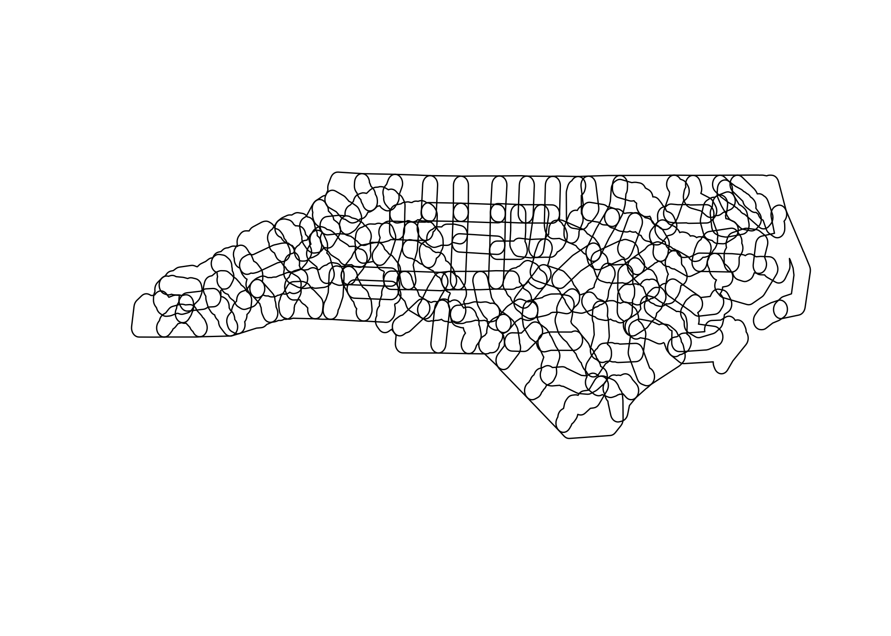

<!---
  Licensed to the Apache Software Foundation (ASF) under one
  or more contributor license agreements.  See the NOTICE file
  distributed with this work for additional information
  regarding copyright ownership.  The ASF licenses this file
  to you under the Apache License, Version 2.0 (the
  "License"); you may not use this file except in compliance
  with the License.  You may obtain a copy of the License at
&#10;    http://www.apache.org/licenses/LICENSE-2.0
&#10;  Unless required by applicable law or agreed to in writing,
  software distributed under the License is distributed on an
  "AS IS" BASIS, WITHOUT WARRANTIES OR CONDITIONS OF ANY
  KIND, either express or implied.  See the License for the
  specific language governing permissions and limitations
  under the License.
-->

# sedonadb

<!-- badges: start -->

<!-- badges: end -->

The goal of sedonadb is to provide an R interface to [Apache
SedonaDB](https://sedona.apache.org/sedonadb). SedonaDB provides a
[DataFusion](https://datafusion.apache.org)-powered single-node engine
with a wide range of spatial capabilities built in, including spatial
SQL with high function coverage and GeoParquet IO.

## Installation

You can install the development version of sedonadb from
[GitHub](https://github.com/) with:

``` shell
git clone https://github.com/apache/sedona-db.git
cd sedona-db/r/sedonadb
R CMD INSTALL .
```

Installing a development version of sedonadb requires a [Rust
compiler](https://rustup.rs) and a GEOS system dependency (e.g.,
`brew install geos` or `apt-get install libgeos-dev`). Install
instructions for these dependencies on other platforms can be found on
the [sf package homepage](https://r-spatial.github.io/sf).

## Example

You can use SedonaDB to read (Geo)Parquet files from anywhere. Filters
are used to reduce the amount of data downloaded based on GeoParquet
and/or Parquet metadata:

``` r
library(sedonadb)

url <- "https://github.com/geoarrow/geoarrow-data/releases/download/v0.2.0/microsoft-buildings_point_geo.parquet"
sd_read_parquet(url) |> sd_to_view("buildings", overwrite = TRUE)

filter <- "POLYGON ((-73.4341 44.0087, -73.4341 43.7981, -73.2531 43.7981, -73.2531 43.8889, -73.1531 43.8889, -73.1531 44.0087, -73.4341 44.0087))"

sd_sql(glue::glue("
  SELECT * FROM buildings
  WHERE ST_Intersects(ST_SetSRID(ST_GeomFromText('{filter}'), 4326), geometry)
")) |> sd_preview()
#> ┌─────────────────────────────────┐
#> │             geometry            │
#> │             geometry            │
#> ╞═════════════════════════════════╡
#> │ POINT(-73.29533522 44.00847556) │
#> ├╌╌╌╌╌╌╌╌╌╌╌╌╌╌╌╌╌╌╌╌╌╌╌╌╌╌╌╌╌╌╌╌╌┤
#> │ POINT(-73.29092778 44.00421331) │
#> ├╌╌╌╌╌╌╌╌╌╌╌╌╌╌╌╌╌╌╌╌╌╌╌╌╌╌╌╌╌╌╌╌╌┤
#> │ POINT(-73.277808 43.998823)     │
#> ├╌╌╌╌╌╌╌╌╌╌╌╌╌╌╌╌╌╌╌╌╌╌╌╌╌╌╌╌╌╌╌╌╌┤
#> │ POINT(-73.277524 44.004619)     │
#> ├╌╌╌╌╌╌╌╌╌╌╌╌╌╌╌╌╌╌╌╌╌╌╌╌╌╌╌╌╌╌╌╌╌┤
#> │ POINT(-73.2774573 44.0044719)   │
#> ├╌╌╌╌╌╌╌╌╌╌╌╌╌╌╌╌╌╌╌╌╌╌╌╌╌╌╌╌╌╌╌╌╌┤
#> │ POINT(-73.27775838 44.0046742)  │
#> └─────────────────────────────────┘
#> Preview of up to 6 row(s)
```

Conversion to and from sf are supported:

``` r
library(sf)
#> Linking to GEOS 3.13.0, GDAL 3.8.5, PROJ 9.5.1; sf_use_s2() is TRUE

nc <- sf::read_sf(system.file("shape/nc.shp", package = "sf"))
nc |> sd_to_view("nc", overwrite = TRUE)

sd_sql("SELECT * FROM nc")
#> ┌─────────┬───┬─────────┬──────────────────────────────────────────────────────┐
#> │   AREA  ┆ … ┆ NWBIR79 ┆                       geometry                       │
#> │ float64 ┆   ┆ float64 ┆                       geometry                       │
#> ╞═════════╪═══╪═════════╪══════════════════════════════════════════════════════╡
#> │   0.114 ┆ … ┆    19.0 ┆ MULTIPOLYGON(((-81.4727554321289 36.23435592651367,… │
#> ├╌╌╌╌╌╌╌╌╌┼╌╌╌┼╌╌╌╌╌╌╌╌╌┼╌╌╌╌╌╌╌╌╌╌╌╌╌╌╌╌╌╌╌╌╌╌╌╌╌╌╌╌╌╌╌╌╌╌╌╌╌╌╌╌╌╌╌╌╌╌╌╌╌╌╌╌╌╌┤
#> │   0.061 ┆ … ┆    12.0 ┆ MULTIPOLYGON(((-81.2398910522461 36.36536407470703,… │
#> ├╌╌╌╌╌╌╌╌╌┼╌╌╌┼╌╌╌╌╌╌╌╌╌┼╌╌╌╌╌╌╌╌╌╌╌╌╌╌╌╌╌╌╌╌╌╌╌╌╌╌╌╌╌╌╌╌╌╌╌╌╌╌╌╌╌╌╌╌╌╌╌╌╌╌╌╌╌╌┤
#> │   0.143 ┆ … ┆   260.0 ┆ MULTIPOLYGON(((-80.45634460449219 36.24255752563476… │
#> ├╌╌╌╌╌╌╌╌╌┼╌╌╌┼╌╌╌╌╌╌╌╌╌┼╌╌╌╌╌╌╌╌╌╌╌╌╌╌╌╌╌╌╌╌╌╌╌╌╌╌╌╌╌╌╌╌╌╌╌╌╌╌╌╌╌╌╌╌╌╌╌╌╌╌╌╌╌╌┤
#> │    0.07 ┆ … ┆   145.0 ┆ MULTIPOLYGON(((-76.00897216796875 36.31959533691406… │
#> ├╌╌╌╌╌╌╌╌╌┼╌╌╌┼╌╌╌╌╌╌╌╌╌┼╌╌╌╌╌╌╌╌╌╌╌╌╌╌╌╌╌╌╌╌╌╌╌╌╌╌╌╌╌╌╌╌╌╌╌╌╌╌╌╌╌╌╌╌╌╌╌╌╌╌╌╌╌╌┤
#> │   0.153 ┆ … ┆  1197.0 ┆ MULTIPOLYGON(((-77.21766662597656 36.24098205566406… │
#> ├╌╌╌╌╌╌╌╌╌┼╌╌╌┼╌╌╌╌╌╌╌╌╌┼╌╌╌╌╌╌╌╌╌╌╌╌╌╌╌╌╌╌╌╌╌╌╌╌╌╌╌╌╌╌╌╌╌╌╌╌╌╌╌╌╌╌╌╌╌╌╌╌╌╌╌╌╌╌┤
#> │   0.097 ┆ … ┆  1237.0 ┆ MULTIPOLYGON(((-76.74506378173828 36.23391723632812… │
#> └─────────┴───┴─────────┴──────────────────────────────────────────────────────┘
#> Preview of up to 6 row(s)
```

``` r
sd_sql("SELECT ST_Buffer(geometry, 0.1) as geometry FROM nc") |>
  st_as_sf() |>
  plot()
```


